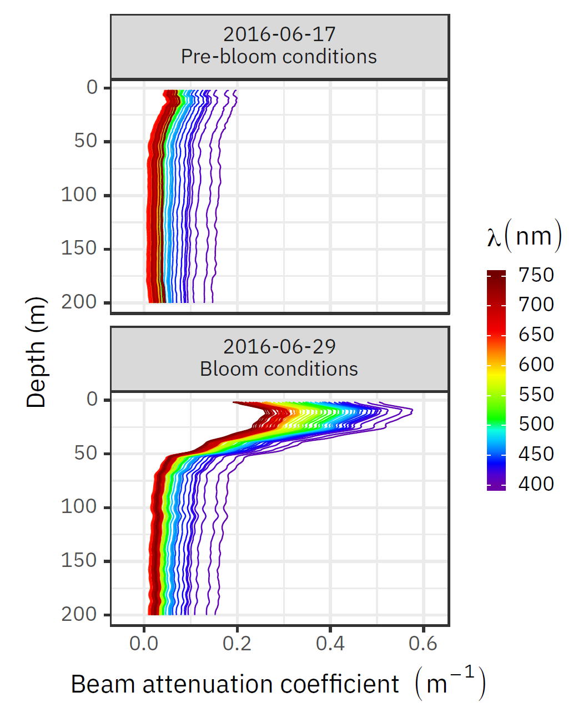

<style type="text/css">
.remark-slide-content {
    font-size: 25px;
    padding: 1em 4em 1em 4em;
}
.remark-inline-code {
    font-size: 0.75em;
}
</style>
```{r setup, include=FALSE}
options(htmltools.dir.version = FALSE)
```

```{r xaringan-themer, include=FALSE}
library(xaringanthemer)
duo(
  code_font_family = "Fira Code",
  code_font_url    = "https://cdn.rawgit.com/tonsky/FiraCode/1.204/distr/fira_code.css",
  text_font_google = google_font("Yanone Kaffeesatz")
)
```

# GreenEdge data: the challenges!

--

- Many sources of data:

--

  - Different formats (xls, csv, mat, dat, etc.).

--

  - Acquired at different temporal/spatial scales.

--

  - Data structure highly variable among the researchers.

--

- **Difficult to exploit the data** (merge, visualization, etc.).

<center>

</center>

---

# Importance of well-structured data

> Most data scientists spend only 20% of their time on actual data analysis and 80% of their time finding, cleaning, and reorganizing huge amounts of data, which is an inefficient data strategy.

<small>
https://www.infoworld.com/article/3228245/the-80-20-data-science-dilemma.html
</small>

--

We put a lot of effort into standardizing the data collected during the GreenEdge campaigns, so you do not have to.

---

# Very important persons

Most of the job has been done by these persons:

.pull-left[

- Joannie Ferland

- Etienne Ouellet

- Flavienne Bruyant

- **Marie-Pier Amyot**

]

.pull-right[
<figure>
  
</figure>
]
---

# What has been done

- Screening the data for possible errors.

  - Outliers, duplicated information, etc.
  
- Regrouping similar data into single files.

  - Ex.: nutrients, absorption
  
- **Data formatting**

  - Data structure: see next slide.
  - Uniformisation: spatial coordinates are the same for all the datasets.
  
---

# Data formatting

Some rules were used to format the data:

- Only use small case letters in variable names.

- No special characters (#$%?&*éê...).

- Dates should be ISO format: `yyyy-mm-dd HH:MM:SS`.

- Units should be added at the end of the variable name (Ex.: `depth_m`).

- Data should be tidy (i.e.: lines = observations, columns = variables).

---

# Data formatting

Each dataset contains a minimum number of columns that can be used to merge the data. **For the ice camp**:

- date

- latitude (`67.479`)

- longitude (`-63.789`)

- sample_type (`water`, `ice`, `meltpond`, ...)

- sample_source (`niskin` or `underice`, ...)

- depth_m (`NA` if sample_type is ice)

- snow_thickness (`thin_snow` or `thick_snow`)

- mission (`ice_camp_2015`, `ice_camp_2016`, `amundsen_2016`)

- PI

---

# Data papers

**Two data papers** in preparation:

- Ice camp 2015-2016: Joannie Ferland (Philippe Massicotte)

- Amundsen 2016: Flavienne Bruyant

- For possible publication in **Earth System Science Data (ESSD)** (I.F.: 8.8)

> Earth System Science Data (ESSD) is an international, interdisciplinary journal for the publication of articles on original research data (sets), furthering the reuse of high-quality data of benefit to Earth system sciences.

---

# Ice camp data paper

<figure>
  <center></center>
</figure>

<!--  -->

---

# Data availability

- Formatted data will be deposed on LEFE-CYBER **along with the original data**.
  - When?

- Data will be citable using the DOI's of the data papers.

- An interactive website has been developped to dynamically browse, filter and download the data.
  - Only available at Takuvik for the moment.

---

# Questions or comments?

<center>

</center>

---

# Happy birthday Marie-Hélène!

<center>

</center>
